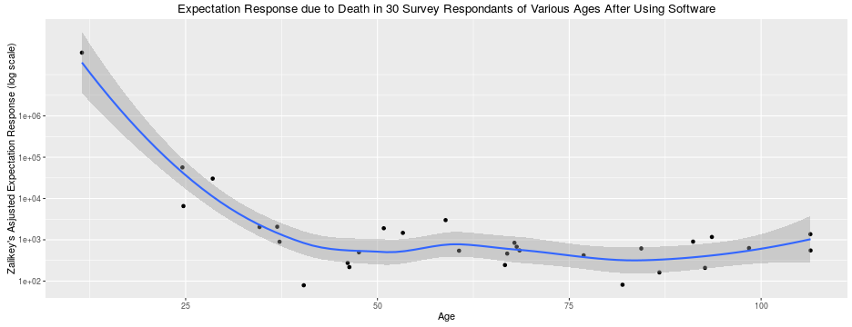

##  The Problem

* People under the age of 50 are nearly 1 million times more surprised by their
  own demise (than people over the age of 110)!

---

##  Bad for Society

* Clearly, reducing surprise of death is important for the health and well-being of society!

---

## Our Proposal: The Death Prediction Evaluation Service

* Software that evaluates personal estimates for remaining years before death
* Provides feedback regarding the quality of those estimates, and helpful tips
  if those estimates were somewhat off
* Collects and displays data regarding the estimates made by others
  * Provides comfort by showing people they are not alone!
  * Gives people a quantitative measure for how much they need to manage their
    expectations!
* After deployment, we predict an eventual 95% reduction in the adjusted
  expectation response in people under 50 years of age
  * Young people will then be more like people over the age of 110!
* https://wwitzke.shinyapps.io/dpredevalserv/

---

## Preliminary Study Results

* Clearly significant reduction in response in respondants under 50 years of age!
* Note impressively small confidence interval of fit line!
* Please give us money!

